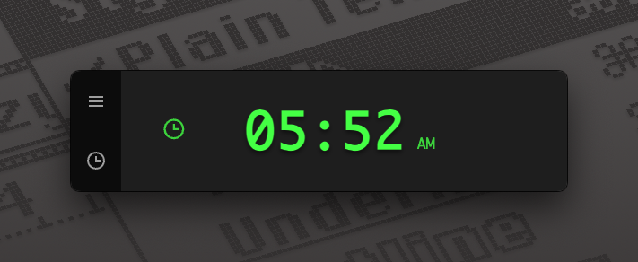
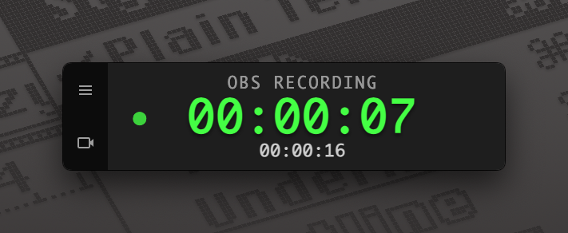
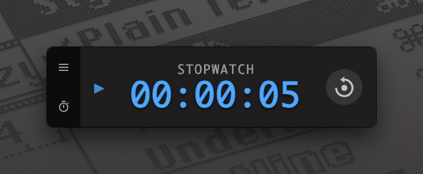
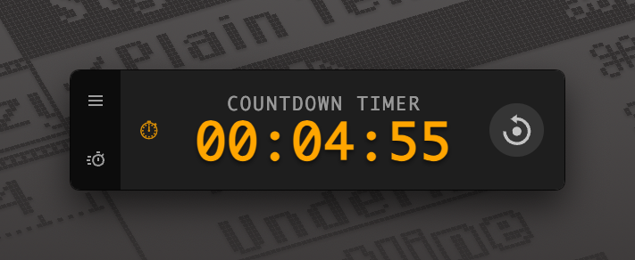

# OBS Timer

A sleek, feature-rich desktop timer for macOS and Windows. This always-on-top application offers multiple timer modes, including seamless integration with OBS Studio. Position it anywhere on your screen, resize it to your liking, and enjoy a modern, frameless design that complements any workspace.

**Note:** _This is a great platform for creating your own timer app -- timers or otherwise. Fork this repo and get started!_

## Timer Modes

Choose from four distinct modes to suit your needs:

| Mode              | Description                                                                              |
| :---------------- | :--------------------------------------------------------------------------------------- |
| **Clock**         | A simple, elegant display of the current time.                                           |
| **OBS Recording** | Connects to OBS Studio to show your live recording duration and total session time.      |
| **Stopwatch**     | A classic stopwatch to time any task with precision.                                     |
| **Countdown Timer** | Set a duration and count down for focused work sessions or reminders.                    |

  
  

  
  

## Features

- **Always on Top**: Floats above all other windows for constant visibility.
- **Resizable & Movable**: Adjust the size and position to fit your screen layout perfectly.
- **OBS Integration**: Automatically connects to OBS Studio via WebSocket to track recording time.
- **Persistent Session Time**: Keeps track of your total recording time across multiple sessions.
- **Modern Design**: A clean, frameless, and transparent UI that looks great.
- **Auto-Reconnection**: Automatically attempts to reconnect if the OBS connection is lost.
- **Cross-Platform**: Built with Electron to run on both macOS and Windows.

## Installation

You can download the latest version of OBS Timer for your operating system from the **[GitHub Releases page](https://github.com/your-username/obs-timer-electron/releases)**.

## Using OBS Mode

To use the OBS Recording mode, you'll need to configure OBS Studio to allow WebSocket connections.

1.  Open OBS Studio.
2.  Go to **Tools** → **WebSocket Server Settings**.
3.  Ensure **Enable WebSocket server** is checked.
4.  Set a **Server Port** (default is `4455`).
5.  Optionally, set a **Server Password** for security.
6.  Click **Apply** and **OK**.

Once configured, open the OBS Timer settings and enter the same host, port, and password to connect.

## Troubleshooting

-   **"OBS WS ✕" or Connection Errors**:
    *   Ensure OBS Studio is running.
    *   Verify the WebSocket server is enabled in OBS (see "Using OBS Mode" above).
    *   Double-check that the host, port, and password in the app's settings match what you configured in OBS.
    *   Check your firewall settings to ensure they aren't blocking the connection.
-   **Timer Not Updating**:
    *   Make sure you are successfully connected to OBS.
    *   Start recording in OBS. The timer only runs when OBS is actively recording.

## Contributing

Interested in contributing to OBS Timer? We'd love your help! Please see our [**Developer Guide**](docs/DEVELOPMENT.md) for instructions on how to build the project from source and contribute changes.

## License

MIT License. See the `LICENSE` file for details.
